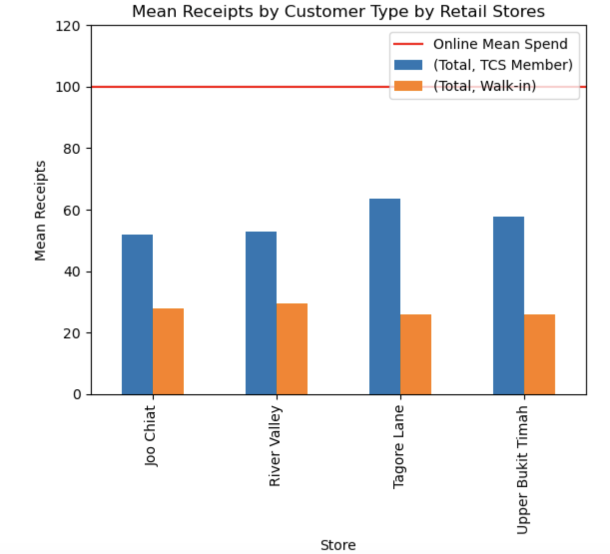
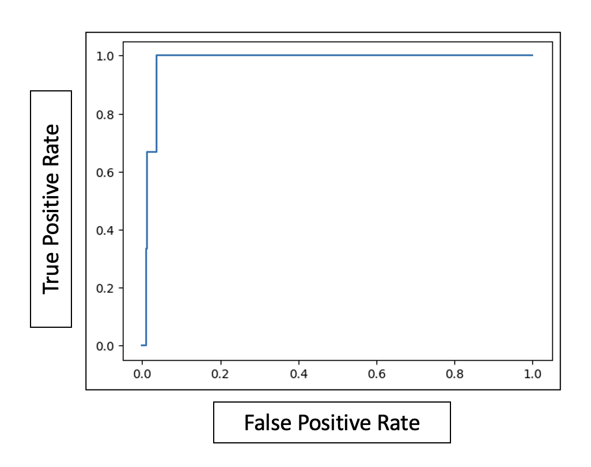

# Capstone Project: Recommender System for The Cheese Shop Pte. Ltd.

## 1. Problem Statement

The Cheese Shop (TCS) Pte. Ltd. relies on retail staff to recommended additional purchase during retail shop check out. Most of the full time retail staff rotates between different roles (arranging shelves, manning cashier, etc) during their shifts, hence, they may not get the full picture of customer purchases and their recommendations would not always be relevant.

TCS intends to improve their revenue of the retail and online stores by having a recommender system which is available at the retail/online stores.

TCS's recommender system will be built using the transaction data from their retail and physical stores.

## 2. Data Collection

Retail Store Transaction Data:

Downloaded via export function on Vend Point of Sale system

Online Store Transaction Data:

Downloaded via export function on BigCommerce system

## 3. Data Cleaning

The information from Vend POS comes in a 3 types of transaction labels, hence the data cleaning was mostly cleaning up data with odd formatting
The BigCommerce transactions were all in one string, hence, extensive cleaning up thru string splitting was done

## 4. Exploratory Data Analysis

The most important insight was that the member mean spend was higher than the walk ins by more than 2 times. Where as online transactions were around 100 dollar, indicating that the online customers were trying to meet their minimum 100 dollar free delivery

## 5. Modelling

Implicit's Least Alternating Squares were used to train and recommend items to users

## 7. Model Evaluation
The Mean AUC Score was 0.853, the closer it is to 1, the better

The AUC Curve indicates a good prediction as well

## 8. Conclusion

i) Discount/deals can be deployed to increase the revenue from walk in customers

ii) As member and walk in may require preplanning of their day activities prior to shopping at TCS, a "Deliver to your home within 4 hours" service could be introduced to encourage these customers to purchase items (such as soft cheese) that they otherwise would not purchase

iii) Propose TCS to synergise their stock system (Vend POS and BigCommerce) into one single system to enable better and repeatable data analysis in the future

## Future Work

i) The Recommender systems can be deployed into Vend POS

ii) The recommender system needs to be compared to the Big Commerce's RecCommerce (recommender system), prior to deployment onto BigCommerce

iii) Hypothesis testing on the performance (revenue difference) of the recommender system in 3 months to confirm customer conversion