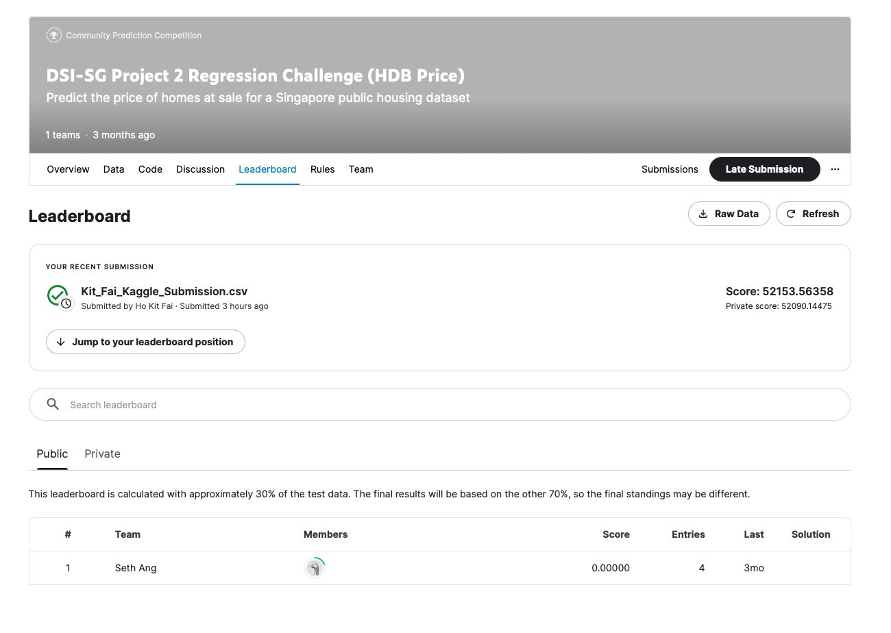

**Problem Statement**

Purchasing a house is often the biggest decision a person/investor can make. From a house buyer point of view, we want to make our house to be value for money (and potential capital appreciation opportunity). While from the standpoint of a seller/investor, we want to make sure that we make the best profit. With a plethora of houses in the market, it is impossible for someone to comb thru every single listing and make a choice.

We firstly want to find out thru exploratory data analysis on the trends of the housing markets such as resale prices, buyer preferences, preferred housing age, etc. This will help our users (either a buyer/seller) understand the market trends.

Then, we will develop a machine learning model to predict the resale price, this will help our users get an accurate picture of what their property is worth. We will do so by first using an all in variables model in linear regression, then conduct feature selection and fit them into linear regression, Lasso, and Ridge respectively.

**Summary of Analysis**
We had created 4 models:
1. Model 1 - Linear Regression Model with All-in Variables
2. Model 2 - Linear Regression Model with selected parameters (thru feature selection)
3. Model 3 - Lasso Regression Model with selected parameters (same as Model 2)
4. Model 4 - Ridge Regression Model with selected parameters (same as Model 2)

Model 1 with the lowest RMSE (43085$) and highest R2 score (0.91) would not be a good model owing to the 300+ parameters potentially introducing noise.
Models 2~4 has approximately the same RMSE (51840$) and R2 score (0.87), we chose to proceed with Model 2 owing to the simplicity and being the least computationally intensive

**Takeaways, Recommendations, and Conclusions**

We have successfully identified vategorical variables that contribute positively (flat models likes terrace, maissonette, S2, and S1, and certain areas like Bukit Timah, Marine Parade, and Bishan) to the resale price. We have also successfully created a machine learning model which explains the contributions of different numerical variables to the resale price.

We would recommend to home buyers to avoid the aforementioned flat models of areas if they are on a budget. In addition, for buyers that requires a large home (say 5 room flats) and yet are on a budget, they can consider choosing lower floors, further from malls, and lower rise blocks (less dwelling units)

Limitations:

We noticed that not all variables are exactly linearly correlated to the resale price, and that many of the variables are highly correlated to each other

Future Work:

1. Improvement to Model: We can write a script to brute force and try every single possible combinations of variables. We can also potentially transform some of the variables to correlate more linearly to the resale price

2. Additional Data: We suspect that there are other influences such as unit facing (east west north south), feature facing (roads, parks, rubbish chute, etc), and also separate the schools into "tiers"

**Kaggle Competition**
