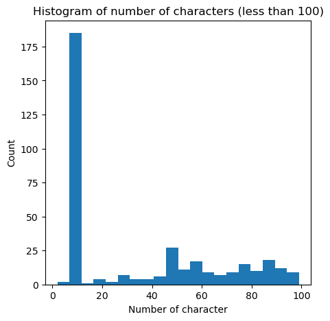
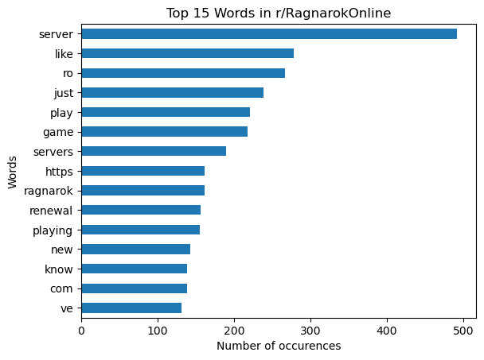
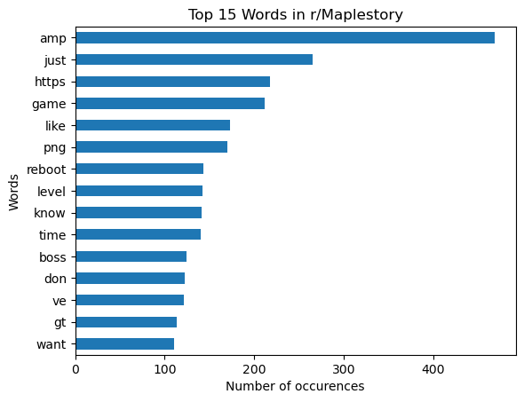

# Project 3: Natural Language Processing

## 1. Problem Statement

Ragnarok Online and Maplestory are one of the hottest Massively Multiplayer Online Role-Playing Game (MMORPG) that is the talk of the town right now. Vast majority of the players are primary school children and secondary school adolescent, hence, their discussions on the gaming forums are often not organised by topic and it often frustrates the forum users on what is going on in the threads.

I am a data scientist engaged by Let's Play Game Forums Pte. Ltd. to leverage the classification capabilities of machines learning to classify the forums threads so that the players can have a better idea on what game they are discussing on.

Considering that reddit is already organised by their topics, we will firstly scrape the posts from reddit, and then use natural language processing method to classify them. We will then evaluate the performance of the machine learning model

## 2. Data Collection

Data was collected via Pushshift API on subreddit r/RagnarokOnline and r/Maplestory. It is then loaded into a Pandas Dataframe for further processing

## 3. Data Cleaning

We took a look at the main content ("selftext" column), created a new column on the number of character count, then filter thru the rows with questionable character count (around less than 20) and clean up the irrelevant rows. The data was then further processed by combining the "title" and "selftext" columns, later tokeninsing and lemmatising the contents

## 4. Exploratory Data Analysis

We took a look several visualisations such as upvote distribution, top authors, and top words.

## 5. Preprocessing

The data was preprocessed by dropping unncessary columns, and the subreddits mapped into 0 and 1. The data is then split (with stratification, which is not critical as our data is rather balanced)

## 6. Modelling

A combination of transformers (CountVectoriser vs TFIDF) and estimator (Naive Bayes vs Logistic Regression) was conducted with GridSearch (5 folds cross validation). A total of 4 models were created

## 7. Model Evaluation
|Model|Transformer|Estimator|Train Score|Test Score a.k.a. Acccuracy|Precision|Recall a.k.a. Sensitivity|
|---|---|---|---|---|---|---|
|6.1|Count Vectoriser|Naive Bayes|0.9900|0.9008|0.9115|0.9133|
|6.2|TFIDF|Naive Bayes|0.9787|0.8931|0.9144|0.9184|
|6.3|Count Vectoriser|Logistic Regression|0.9987|0.9059|0.8922|0.8878|
|6.4|TFIDF|Logistic Regression|1.000|0.916|0.8905|0.8827|

Accuracy was chosen as the main metric for evaluation. We would recommend Model 6.1 and 6.4 as their performance are the best and the computational requirements are largely similar

## 8. Conclusion

The Model 6.1 and Model 6.4 achived an accuracy of 90% and 92%, which is significantly better than the baseline model (around 50%, it's as good as flipping a coin).

The client is able to use the models developed to clean up their forums and classify the posts in the forum to help the forum achieve a better user experience.

## Future Work

1. The dataset used is only 1000 posts, but the gridsearch work is already taking up a lot of computation resources. We will consider using more subreddits of similar contents to create a better classification model at the expense of some increase in computational requirements

2. The client can consider creating subforums in their system for new and upcoming games in order to keep the forums organised from Day 1

3. The NLP model can be further extended to create forum tags to further subdivide and improve the topic search for the users